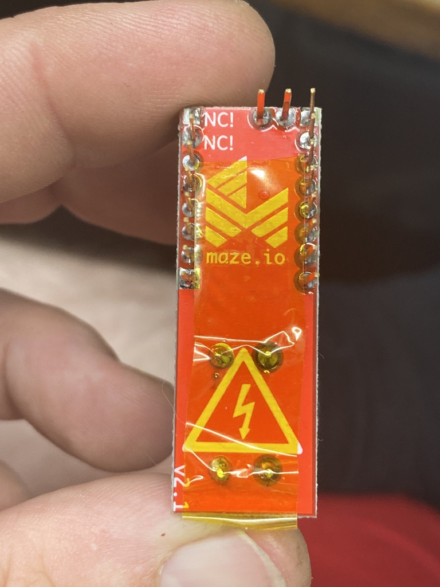

# PowerBRRR 

 

48V injection daughter board for Step Stick drivers.

## 48V capable hardware

### Mainboards

| Manufacturer | HV ports | Capacitor rating | Max motor amperage (recommended) |
|-|-|-|-|
| [Annex Engineering SuperNova](https://store.annex.engineering/products/constellation-supernova-beta-0-1) | 4 | 330µF 63V | 3.3A |
| [BigTreeTech Octopus Pro](https://s.click.aliexpress.com/e/_A7pmpM) | 8 | 110µF 63V | 1.1A |
| [Fysetc Spider 2](https://s.click.aliexpress.com/e/_Ao7vds) | 2 | 110µF 63V | 1.1A |
| [Mellow FLY Gemini](https://s.click.aliexpress.com/e/_AWuUII) | 4 | 110µF 50V | 1.1A |
| [Mellow FLY Super 8 HV](https://s.click.aliexpress.com/e/_ApXre6) | 3 | 110µF 50V | 1.1A |

### Stepper drivers

There are multiple HV-options (beyond 24V), pay close attention to the maximum safe voltage (based on the components on the boards)!

| Manufacturer | Driver chip | Rated voltage | Max safe voltage |
|-|-|-|-|
| [BigTreeTech TMC2130](https://s.click.aliexpress.com/e/_AdHelD) | TMC2130 | 45V | 42V |
| [BigTreeTech TMC5160](https://s.click.aliexpress.com/e/_AKRDf1) | TMC5160 | 35V | 32V |
| BigTreeTech TMC5160 Pro | TMC5160 | 60V | **48V** |
| [Fysetc TMC2130](https://s.click.aliexpress.com/e/_ATkJz9) | TMC2130 | 45V | 42V |
| [Fysetc TMC5160](https://s.click.aliexpress.com/e/_ATkJz9) | TMC5160 | 35V | 32V |
| Fysetc TMC5160 HV | TMC5160 | 60V | **48V** |
| [IdeaFormer TMC2130 V1.2](https://s.click.aliexpress.com/e/_AdHelD) | TMC2130 | 45V | 42V |
| [Mellow TMC5160 HV](https://s.click.aliexpress.com/e/_A8PwqQ) | TMC5160 | 60V | 42V |
| [Watterott TMC2130](https://shop.watterott.com/SilentStepStick-TMC2130-Stepper-Motor-Driver) | TMC2130 | 45V | 42V |
| [Watterott TMC5160 HV](https://shop.watterott.com/SilentStepStick-TMC5160-Stepper-motor-driver-HV-V15) | TMC5160 | 60V | **48V** |

The links provided are affiliate links, they cost you nothing extra but provide me with a small kick back to buy stuff for R&D

## Warning
Using 48V electronics can cause serious harm on injury, only attempt to install this on your printer if you know what you are doing.

Under no circumstances I can be held responsible for harm or injury to any person or piece of equipment and you waiver all rights to hold me responsible for anything that happens as a result of using my design, or even thinking about my design.

## Boards

* **PowerBRRR for BigTreeTech SKR 1.x/2.x**:
  * [Gerber_PowerBRRR SKR](./Gerber_PowerBRRR%20SKR_2021-09-22.zip)
* **PowerBRRR for BigTreeTech SKR Pro/Octopus, Fysetc Spider, FLY F407, etc.**: 
  * [Gerber_PowerBRRR Octopus_Spider](./Gerber_PowerBRRR%20Octopus_Spider_2021-09-22.zip)

Suggested manufacturing is using 2oz copper or gold traces.

## Bill of materials

* 1x 220µF (2A) / 330µF (3A) / 470µF (4A) 63V 13x25 capacitor
* 1x WJ127-5.0-2P screw terminal
* 2x 8P 2.54mm pitch stacking headers
* 1x 2P 2.54mm pitch stacking headers
* 1x SOD123FL

## Assembly

Make sure the VM pin is cut short; you can leave GND:

Suggested stepstick and motor power connector placement:

Cover the back with kapton tape, nobody likes to get zapped accidentally ([unless it generates views you can monetize](https://www.youtube.com/channel/UCJ0-OtVpF0wOKEqT2Z1HEtA)).

# Builds

## Fysetc Spider 1.x by [netweaver](https://github.com/netweaver1970)

This is on the [Fysetc Spider 1.x](https://s.click.aliexpress.com/e/_AX27Ty) mainboard (8 driver slots).

